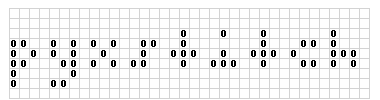

pyxstitch
=========

   Screenshot

pyxstitch is an application (and associated library/compenents) that
takes source code files and produces syntax-highlighted patterns for
cross stitching.

See a examples and completed cross stitch patterns
`here! <https://enckse.github.io/pyxstitch/>`__

|Build Status| |Build status|

install
=======

pip
---

Available via `pip <https://pypi.python.org/pypi/pyxstitch/>`__

::

    pip install pyxstitch

source
------

-  Clone this repo and…

::

    python setup.py install

or

::

    pip install .

or

::

    pip install -e .

os packaging
------------

+------------+----------------------------------------------------------------+
| os         | link                                                           |
+============+================================================================+
| arch linux | `aur <https://aur.archlinux.org/packages/python-pyxstitch/>`__ |
+------------+----------------------------------------------------------------+

usage
=====

to run

::

    pyxstitch --file program.py

styling
~~~~~~~

to see actual highlight colors on the pattern use ``--theme light-dmc``
and if using a high-contrast style you may want to toggle
``--theme dark`` (or ``--theme dark-dmc`` for colors on dark
backgrounds).

the coloring styles are available as part of the pygments project but
can be passed like so

::

    pyxstitch --file program.py --style monokai

output
~~~~~~

by default a png file is created matching the source code file name
(e.g. ``hello.py`` -> ``hello.png``), to change this

::

    pyxstitch --file program.py --output image.png

or just pass a file type and type/cat into pyxstitch

::

    cat test.py | pyxstitch --file .py --output myimage.png

by default, pyxstitch will attempt to create multiple pages for easier
reading of large patterns, this can be modified via ``--multipage``.

syntax/lexer
~~~~~~~~~~~~

by default pyxstitch will use just a text lexer (no syntax) if
piped/stdin is used, that can be changed, so

::

    cat test.py | pyxstich

produces no highlighting but

::

    cat test.py | pyxstitch --file .py
    # or
    cat test.py | pyxstitch --lexer autodetect
    # or tell it which pygments lexer to use
    cat test.py | pyxstitch --lexer python

fonts
~~~~~

to select a different font (from available)

::

    pyxstitch --font <type-charset-size>

floss colors
~~~~~~~~~~~~

colors can be remapped or disabled, e.g. to disable a color, set it to
map to empty

::

    pyxstitch --file test.c --map 000000=

or to map one color to another

::

    pyxstitch --file test.c --map 000000=ffffff
